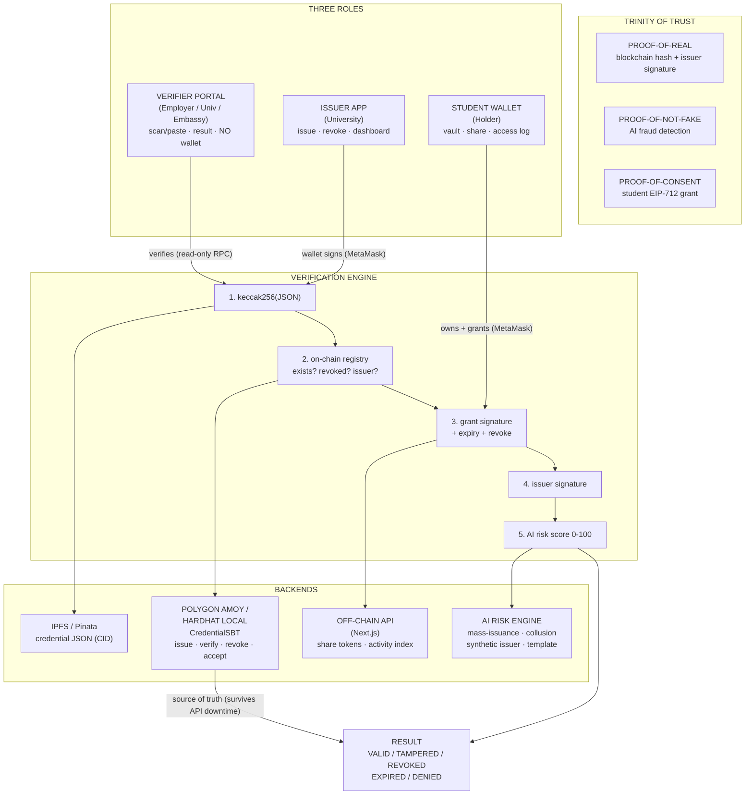
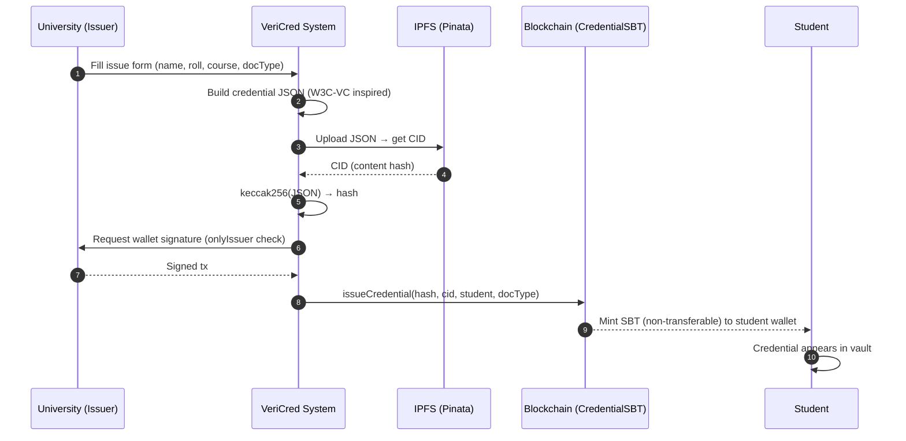
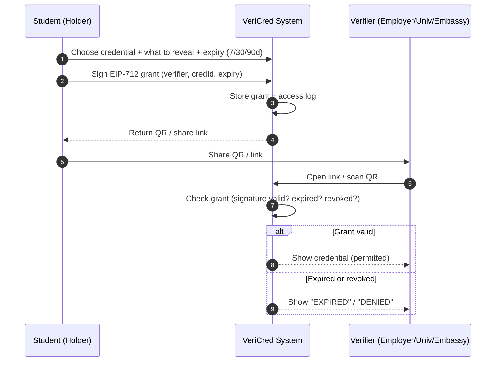
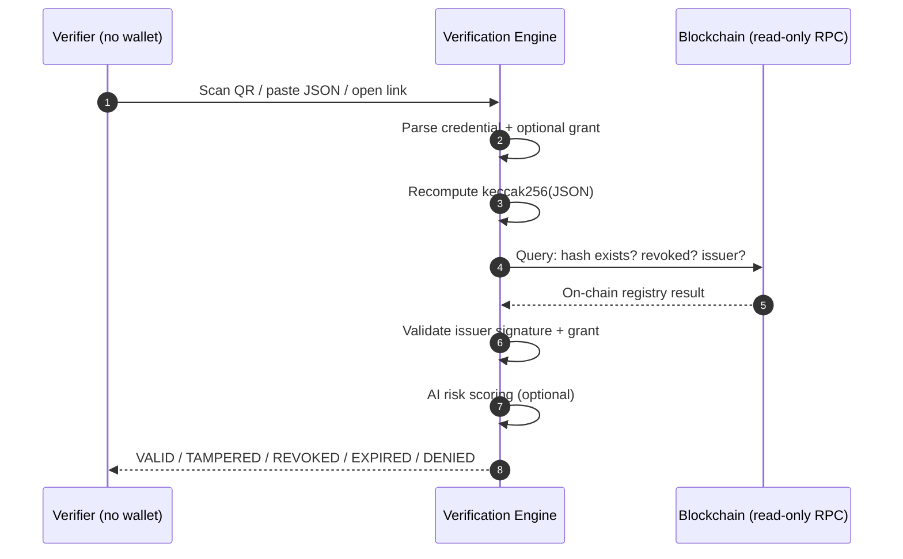
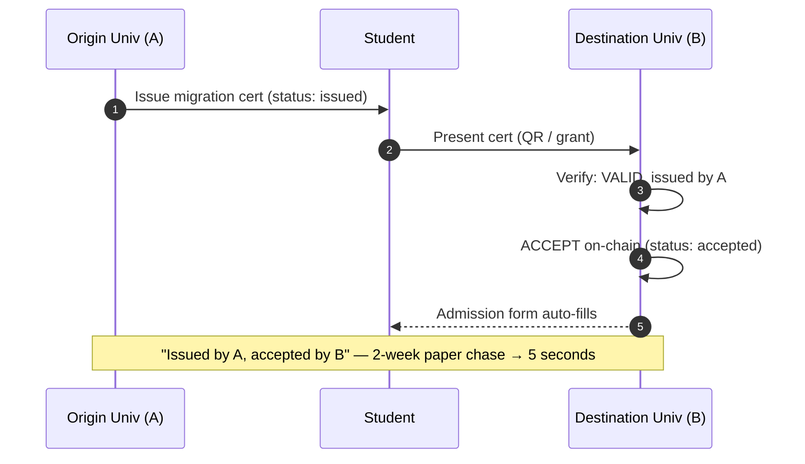
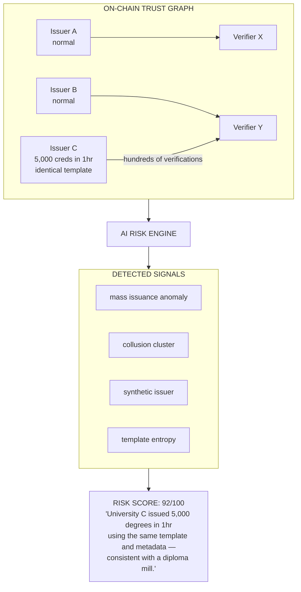
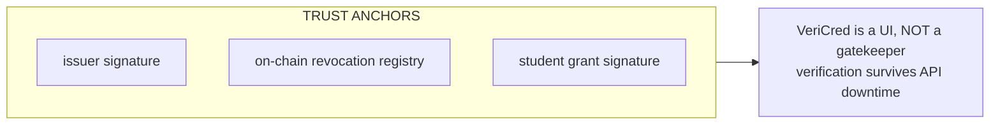
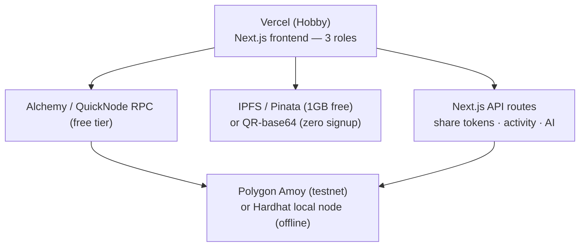

# VeriCred — Architecture Diagrams (Mermaid)

> Mermaid.js version of the full system architecture.
> Companion to `SOLUTION-BRIEF.md` and `ARCHITECTURE.md`.

---

## 1. High-Level Architecture (everything in one view)

---

## 2. Issuance Flow (University → Student)

---

## 3. Permissioned Access Flow (Student → Verifier)

---

## 4. Verification Flow (wallet-free)

---

## 5. Migration Certificate (two-party: issue → present → accept)

---

## 6. AI Immune System (fraud-network detection)

---

## 7. Trust Model (what you actually believe)

---

## 8. Deployment Topology (free tier)

